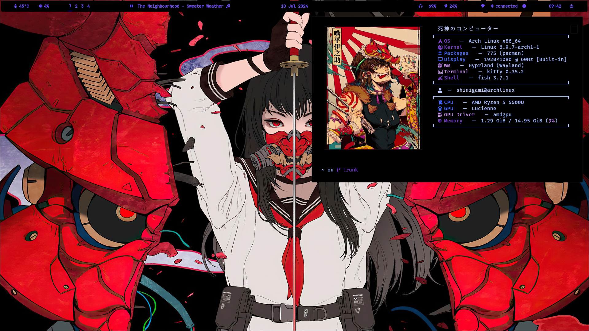
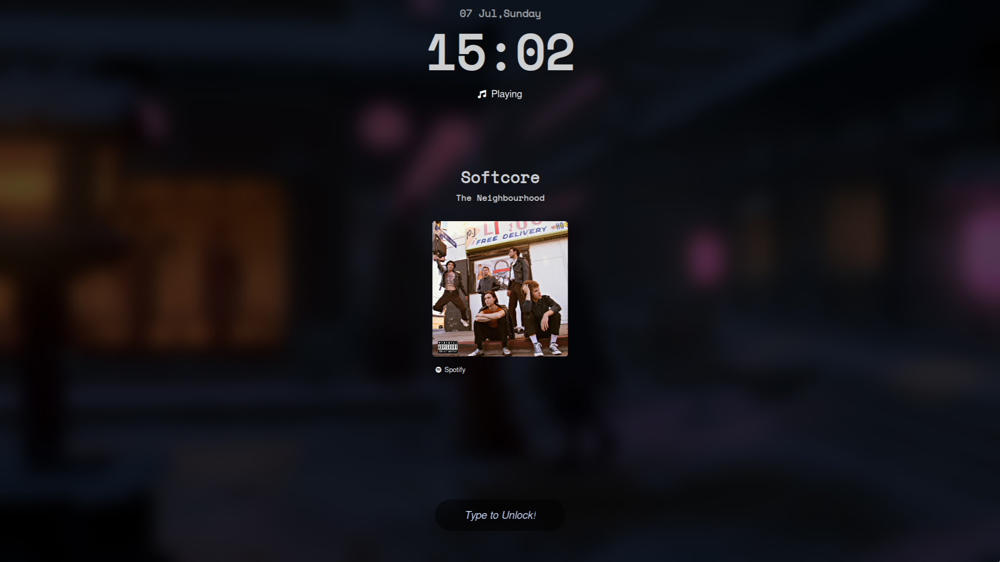
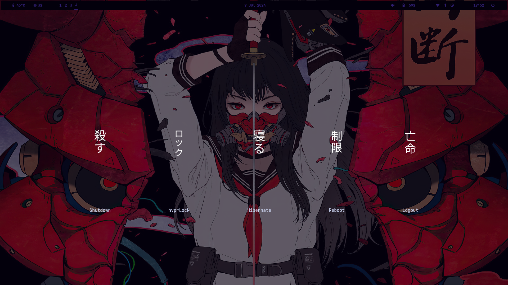
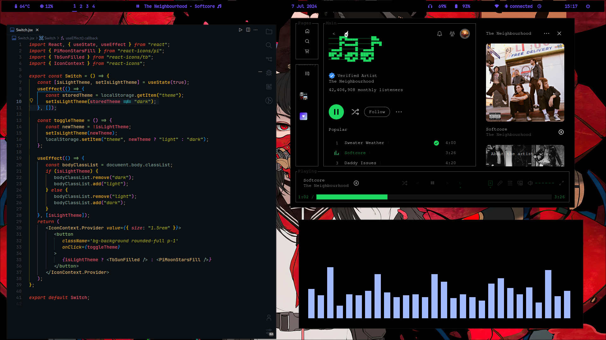
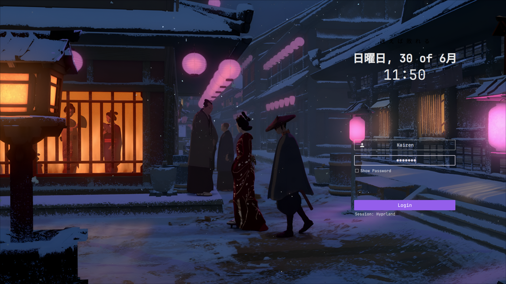
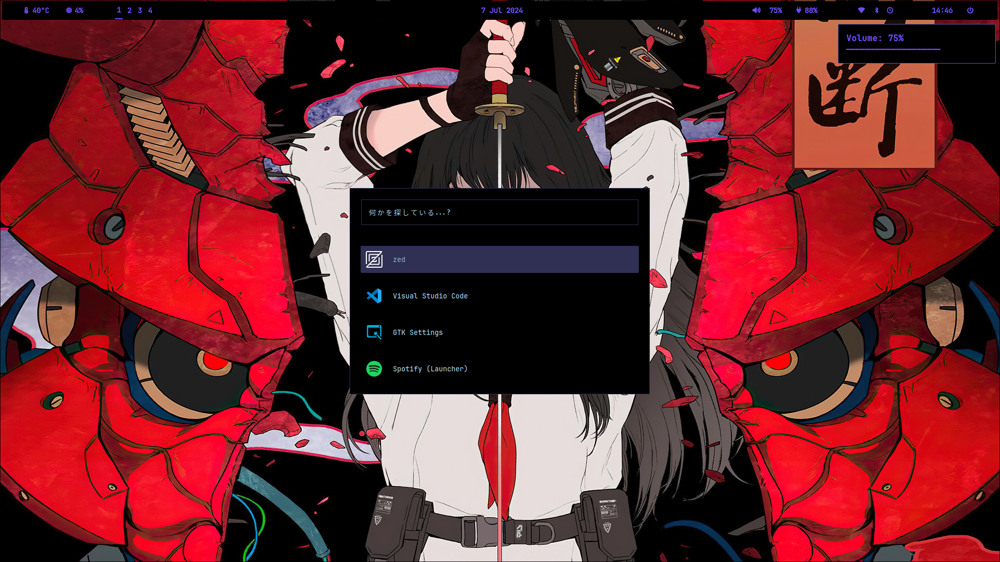

<h1 align="left">Kaizen's  .Dotfiles</h1>

<h2 align="left">About 💡</h2>
 
<p style=" font-size: 1.2rem" align="left">My Desktop(Arch Linux + Hyprland) setup I use as my daily driver</p>

###

<h2 align="left">Previews 📸</h2>

###

<div align="center">
  
</div>

###

<div align="center">
  
</div>

###

<div align="center">
  
</div>

###

<div align="center">
  
</div>

###

<div align="center">
  
</div>

###

<div align="center">
  
</div>

<h2 align="left">System Info ⚙️</h2>

-  Windows Manager 🖥️
   -  [Hyprland](https://github.com/hyprwm/Hyprland)
-  Status Bar 🍫
   -  [Waybar](https://github.com/Alexays/Waybar)
-  Web Browser 🕸️
   -  [Firefox-Dev](https://github.com/topics/firefox-developer-edition)
   -  [Startpage](https://github.com/topics/firefox-developer-edition)
-  Terminal 📟
   -  [Kitty](https://sw.kovidgoyal.net/kitty/)
-  Text Editor 📜
   -  [Zed](https://github.com/zed-industries/zed)
   -  [VsCode](https://code.visualstudio.com/)
   -  [NeoVim](https://github.com/neovim/neovim)
-  Shell 🐌
   -  [Zsh](https://github.com/ohmyzsh/ohmyzsh)
   -  [Fish](https://github.com/fish-shell/fish-shell)
-  Launcher 🚀
   -  [Rofi](https://github.com/davatorium/rofi)
-  Lockscreen 🔒
   -  [Hyprlock](https://github.com/hyprwm/hyprlock)
-  File Manager 📁
   -  [Yazi](https://github.com/sxyazi/yazi)

###

<h2 align="left">Installation</h2>

> [NOTE]  
> The install script is still in development and will be added as soon as it is completed.

Install the required packages and then adjust the configuration, referencing my dotfiles. Feel free to incorporate your own customizations as well.

Also remember to make all the scripts executable by:

```
$ chmod +x /path/to/the/scripts
```

<h4 align="left">Thank You!</h4>
